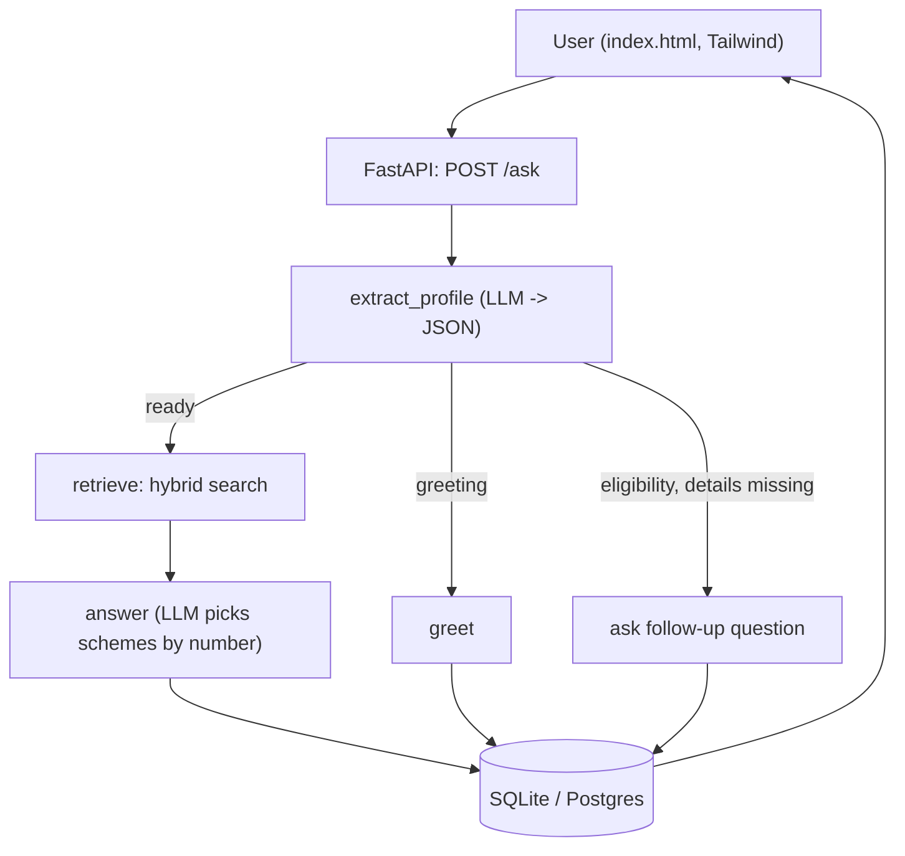

# YojanaSaathi 🇮🇳

**An AI agent that helps people find Indian government schemes they may be eligible for, in simple Hinglish.**

A user describes their situation in plain language ("Main 25 saal ka hoon, rehri lagata hoon, loan milega?"). The agent asks for any missing details (age, occupation, income), searches a curated scheme database, and answers with the relevant schemes and their **official source links**.

> **Live demo:** _coming soon (Render)_
> **Note:** the free hosting tier sleeps when idle, so the first load can take about a minute.

<!-- Add a screenshot or GIF here:  -->

---

## Why I built this

Many people do not know which government schemes they qualify for, and official sites are hard to navigate. Most chatbots answer in English and make things up. YojanaSaathi answers in Hinglish, only from a verified scheme database, and always links the official source.

## Features

- **Conversational slot-filling:** the agent asks for age, occupation and income one at a time, only when needed.
- **15 central government schemes** (PM-Kisan, Ayushman Bharat, PM SVANidhi, Mudra, Sukanya Samriddhi, Atal Pension, PM Vishwakarma, e-Shram, NSP scholarships, Stand-Up India and more).
- **Grounded answers:** the LLM answers only from retrieved scheme text and returns official source links.
- **Hybrid retrieval:** vector search + keyword matching (see below for why).
- **Out-of-scope refusal:** questions like "Bitcoin mein paisa kaise lagayein?" get no scheme recommendations.
- **Session memory:** profile and chat history are stored per session (SQLite by default, Postgres via `DATABASE_URL`).
- **Evaluation suite:** a 20-question eval set with retrieval and answer metrics.
- **Dockerized**, with a single-service setup (FastAPI serves the UI too).

## Architecture



**Agent flow (LangGraph):**

1. `extract_profile`: pulls age, occupation, income, state, gender and intent out of the message and merges it with the saved profile.
2. A router decides: greet, ask a follow-up, or retrieve.
3. `retrieve`: rewrites the Hinglish question into a short English query, then runs hybrid search.
4. `answer`: the LLM writes the reply and returns the **numbers** of the schemes it used, so sources are mapped by index instead of fragile exact-name matching.

## Tech stack

| Layer | Tech |
|---|---|
| Backend | FastAPI, Uvicorn |
| Agent | LangGraph |
| LLM | Groq (currently `openai/gpt-oss-20b`) |
| Retrieval | ChromaDB (vector) + keyword matching |
| Storage | SQLite (default), Postgres (optional via `DATABASE_URL`) |
| Frontend | HTML, Tailwind CSS (CDN), vanilla JavaScript |
| Packaging | Docker |

## Evaluation

I built a 20-question eval set: 17 in-scope questions with an expected scheme, and 3 out-of-scope questions where the agent should recommend nothing. A question passes only if the expected scheme is in the answer **and** no wrong scheme is listed.

| Metric | v1 (vector search only) | v2 (keywords + index-based sources) | v3 (hybrid search) |
|---|---|---|---|
| Overall pass | 50% (10/20) | 80% (16/20) | 100% (20/20) |
| Retrieval recall@5 | 64% | 76% | 100% |
| Answer hit rate | 52% | 76% | 100% |
| Clean (no wrong scheme) | 76% | 100% | 100% |
| Out-of-scope refused | 100% | 100% | 100% |

**What I found and fixed**

- The embedding model is English-centric, but the data and questions are Hinglish. Words like "rehri" or "kisan" did not retrieve the right scheme, which capped retrieval recall at 64%.
- Fix 1: added English and Hinglish keywords to every scheme document.
- Fix 2: the LLM now returns scheme numbers instead of exact names, which removed most "source mismatch" failures.
- Fix 3: hybrid retrieval, combining vector search with keyword matching, so "kisan fasal kharab" reliably surfaces PM Fasal Bima, PM-Kisan and KCC.

**Honest caveats**

- The eval set is small (20 questions), and I tuned the system while looking at its failures, so 100% is a **development-set** score, not a measure of real-world accuracy.
- I also rewrote 4 test questions after the first run (two were too strict, two lacked the details the agent needs), so v1 and v3 are not a perfectly fair comparison.
- Next step: a held-out set of unseen questions written by other people.

Run it yourself:

```bash
python -m evals.runs_eval
```

## Project structure

```
yojana-saathi/
├── app/
│   ├── main.py            # FastAPI app, serves UI + /ask
│   ├── db.py              # SQLite / Postgres storage
│   ├── agent/
│   │   ├── graph.py       # LangGraph wiring
│   │   └── nodes.py       # profile extraction, routing, answer
│   ├── rag/
│   │   ├── ingest.py      # builds the search index + keywords
│   │   └── retriever.py   # hybrid search
│   └── schemes/
│       └── schemes.json   # scheme data
├── ui/index.html          # chat UI
├── evals/
│   ├── test_questions.json
│   └── runs_eval.py
├── Dockerfile
├── requirements.txt
└── .env.example
```

## Run locally

**1. Clone and install**

```bash
git clone https://github.com/<your-username>/yojana-saathi.git
cd yojana-saathi
python -m venv venv
venv\Scripts\activate          # Mac/Linux: source venv/bin/activate
pip install -r requirements.txt
```

**2. Add your Groq API key** (free at console.groq.com)

```bash
copy .env.example .env         # Mac/Linux: cp .env.example .env
# then edit .env and set GROQ_API_KEY=...
```

**3. Build the search index and start the server**

```bash
python -m app.rag.ingest
uvicorn app.main:app --reload
```

Open **http://127.0.0.1:8000**.

## Run with Docker

```bash
docker build -t yojana-saathi .
docker run --env-file .env -p 8000:8000 yojana-saathi
```

## API

`POST /ask`

```json
{ "question": "Meri umar 25 hai, rehri lagata hoon, loan milega?", "session_id": "abc123" }
```

Response:

```json
{
  "answer": "PM SVANidhi: ...",
  "profile": { "age": 25, "occupation": "street vendor" },
  "sources": [{ "name": "PM SVANidhi (Rehri-Patri Loan)", "url": "https://pmsvanidhi.mohua.gov.in" }]
}
```

Other endpoints: `GET /history/{session_id}`, `GET /health`.

## Configuration

| Variable | Required | Purpose |
|---|---|---|
| `GROQ_API_KEY` | Yes | LLM access |
| `DATABASE_URL` | No | If set, uses Postgres instead of SQLite |
| `SQLITE_PATH` | No | Custom SQLite file location |

## Known limitations

- **Eligibility is LLM-judged, not rule-based.** The agent can say "you may be eligible" without checking every rule (for example land records for PM-Kisan). It currently asks for age, occupation and income even when a scheme does not need all three.
- **Scheme data is a summary** from public sources and **may be outdated.** Rules, amounts and deadlines change. Always verify on the official site before applying.
- Only **15 central schemes**; no state-specific schemes yet.
- With SQLite on a free host, chat history is lost when the server restarts.
- Hinglish spelling variations ("rehri", "rehdi") can still miss the keyword match.

## Roadmap

- [ ] Rule-based eligibility checks per scheme (age, income, category, land)
- [ ] Held-out eval set and a larger question bank
- [ ] Postgres + deployment on AWS (ECS, RDS)
- [ ] CI with GitHub Actions (run evals on every push)
- [ ] State-level schemes and Hindi (Devanagari) input
- [ ] Tracing and cost/latency monitoring

## Disclaimer

YojanaSaathi provides general information only and is not an official government service. Verify eligibility, documents and deadlines on the official website before applying.

---

Built by **Ishwar Dhakad**. Backend, agent, evaluation and deployment are my work; I used AI assistance for code generation and the frontend.